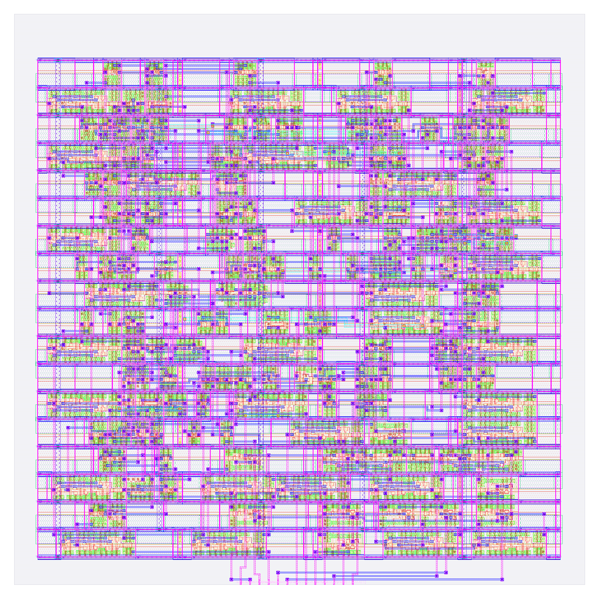
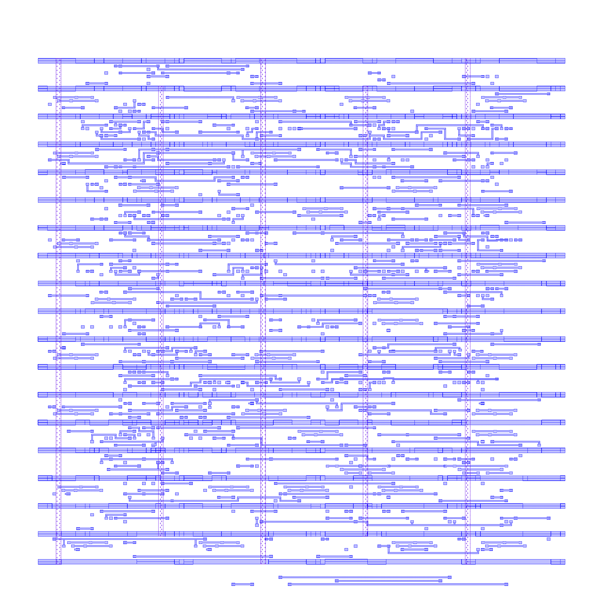
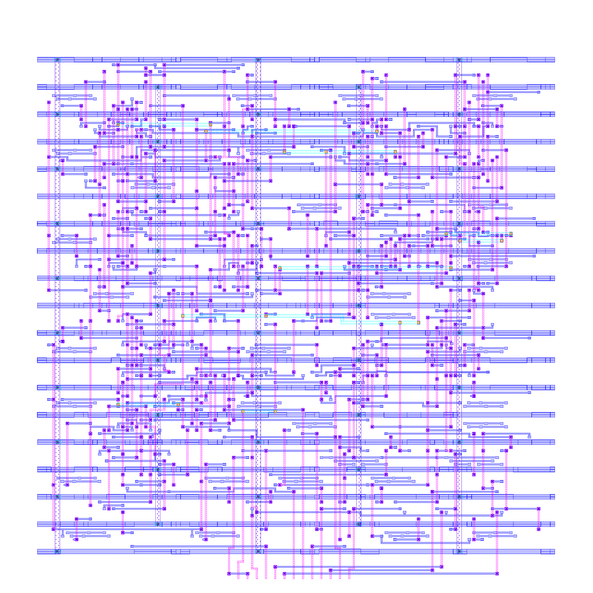
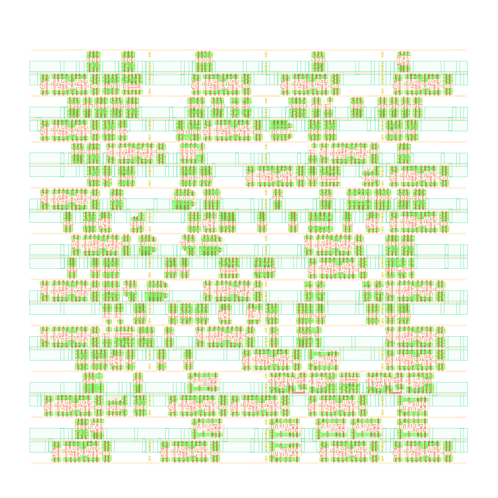
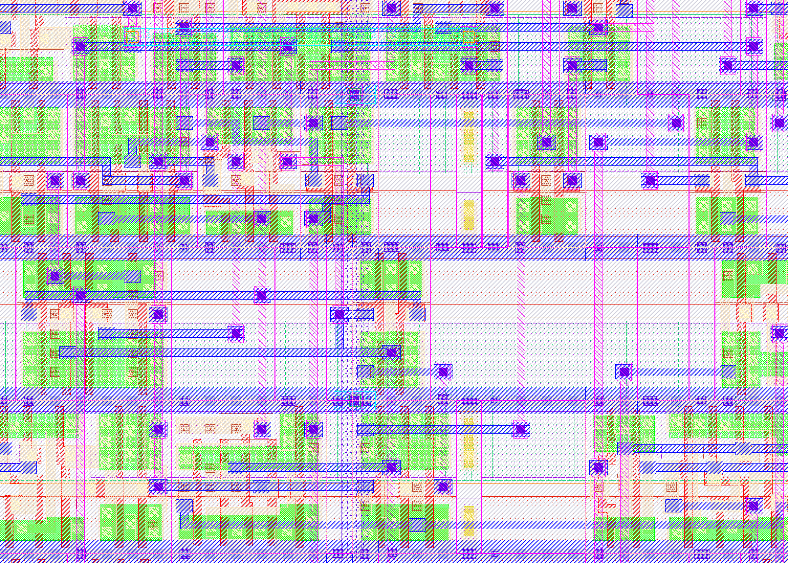

# UART — RTL to GDSII on SkyWater 130 nm

A UART transmitter taken from SystemVerilog RTL to a tape-out-ready GDSII
layout using only open-source EDA tools, targeting the SkyWater `sky130A`
open PDK.

Every stage was run manually before being automated, so this repository is
both a working flow and a record of what each backend tool actually does.

```bash
./run_flow.sh        # RTL → GDSII, one command, ~5 minutes
```

---


<sub>Full layout — 447 placed instances across 18 standard cell rows, routed on met1–met4.</sub>

| | |
|:--:|:--:|
|  |  |
| **Power distribution** — met1 followpins rails (cyan) with met4 straps at 20 µm pitch (gold) | **Routing only** — met1–met4 signal wiring with the cells hidden |
|  |  |
| **Device layers** — nwell, diffusion, poly and li1, no metal | **Detail view** — individual transistors, contacts and local interconnect |

## Result

| | |
|---|---|
| **Technology** | SkyWater 130 nm, `sky130_fd_sc_hd` standard cells |
| **Die area** | 56.2 µm × 56.2 µm |
| **Cell area** | 1443 µm², 57 % utilisation |
| **Standard cells** | 157 logic + 30 tap + 260 fill = 447 placed instances |
| **Clock** | 50 MHz (20 ns period) |
| **Setup slack** | **+15.03 ns** (MET) |
| **Hold slack** | **+0.44 ns** (MET) |
| **TNS / WNS** | 0.00 / 0.00 — no timing violations |
| **LVS** | `Circuits match uniquely` — 157/157 devices, 170/170 nets |
| **DRC** | **0 violations** on the streamed GDSII |
| **GDSII** | [`signoff/uart.gds`](signoff/uart.gds), 581 KB |

Timing is signed off against **real extracted parasitics** (SPEF from the
routed geometry), not wireload estimates.

---

## The flow

| Stage | Tool | What it produces |
|---|---|---|
| 1. RTL simulation | Icarus Verilog | Functional correctness before any synthesis |
| 2. Logic synthesis | Yosys + ABC | RTL → gate-level netlist mapped to Sky130 cells |
| 3. Pre-layout STA | OpenSTA | Timing on ideal wires — first reality check |
| 4. Floorplan + PDN | OpenROAD | Die/core area, I/O pins, VPWR/VGND power grid |
| 5. Placement | OpenROAD | Global placement, then legalisation onto row sites |
| 5b. Tap + fill | OpenROAD | Well taps (latch-up) and fillers (well continuity) |
| 6. Clock tree synthesis | TritonCTS | Balanced clock distribution, buffer insertion |
| 7. Routing | TritonRoute | Global + detailed routing on met1–met5, SPEF extraction |
| 8. Signoff STA | OpenSTA | Timing with real RC parasitics |
| 9a. Extraction | Magic | Netlist derived from actual layout polygons |
| 9b. LVS | Netgen | Layout netlist ≡ schematic netlist (graph isomorphism) |
| 9c. DRC | Magic | Manufacturability rules checked on the GDSII |
| 10. GDSII | Magic | Final stream-out |

```
   rtl/UART.sv
        │
        ├─► sim ──────────────► tb_UART.vcd
        │
        ▼
   synth/uart_synth.v ────────► sta (pre-layout)
        │
        ▼
   floorplan/uart_floorplan.def
        │
        ▼
   pnr/uart_placed.def
        │
        ▼  tapcell + filler
   pnr/uart_placed_tapfill.def
        │
        ▼  CTS + global_connect
   pnr/uart_cts_tapfill.def
        │
        ▼  global + detailed route
   pnr/uart_routed_tapfill.def ──► .spef ──► sta (signoff)
        │
        ├─► magic extract ──► uart_extracted.spice ─┐
        │                                           ├─► netgen LVS ─► comp.out
        └─► openroad write_verilog ──► UART.lvs.v ──┘
        │
        ▼
   signoff/uart.gds ──► magic DRC ──► 0 violations
```

---

## Repository layout

```
rtl/          UART.sv                     source RTL
sim/          tb_UART.sv                  testbench
constraints/  uart_50mhz.sdc              timing constraints
synth/        synth_uart.ys               Yosys script + netlist
sta/          sta_*.tcl                   pre-layout and signoff STA
floorplan/    floorplan_uart.tcl          die area, pin placement, PDN
pnr/          placement, tapfill, CTS, routing scripts + DEF/SPEF outputs
signoff/      extraction, LVS, DRC, GDS scripts + uart.gds, comp.out
logs/         per-stage logs from the last full run
run_flow.sh   the whole flow, with per-stage verification
cleanup.sh    whitelist-based working-directory cleanup
```

---

## Running it

**Requirements:** `iverilog`, `yosys`, `sta`, `openroad`, `magic`, `netgen`,
and the `sky130A` PDK.

```bash
export PDK_ROOT=/path/to/pdk          # dir containing sky130A/
export PDKPATH=$PDK_ROOT/sky130A

# Magic resolves vendor GDS through $PDKPATH/libs.ref/...
mkdir -p $PDK_ROOT/sky130A/libs.ref
ln -sfn $PDK_ROOT/sky130A/sky130_fd_sc_hd \
        $PDK_ROOT/sky130A/libs.ref/sky130_fd_sc_hd

./run_flow.sh                # everything
./run_flow.sh cts            # resume from a stage
./run_flow.sh -1 lvs         # run a single stage
```

`run_flow.sh` checks prerequisites up front and fails immediately with a
specific message if a tool or PDK file is missing.

---

## Why the flow verifies artifacts, not exit codes

Every tool in this flow — Yosys, OpenROAD, Magic, Netgen — will exit **0**
while producing unusable output. So each stage asserts on what was actually
written:

| Stage | Assertion |
|---|---|
| Synthesis | netlist contains real `dfxtp` flip-flops (catches failed `dfflibmap`) |
| Floorplan | DEF contains `ROW` entries (catches missing `make_tracks`) |
| Tap / fill | tap **and** fill counts both non-zero |
| CTS | VPWR/VGND connected to every logic cell |
| Routing | TritonRoute's DRC report is empty |
| LVS netlist | all four supply pins on every instance; no physical-only cells |
| LVS | log reports `Circuits match uniquely` |
| GDSII | file ≥ 100 KB **and** no `Can't find` in the Magic log |
| DRC | violation count parsed and equal to zero |

---

## Four bugs worth knowing about

Each of these produced a silent, exit-code-zero failure. They are the reason
the checks above exist.

### 1. Clock buffers left unpowered

`global_connect` ran during floorplanning. TritonCTS inserted clock buffers
two stages later, so those buffers were never connected to VPWR/VGND in the
database. LVS reported a net count of 512 against the layout's 174.

The excess decomposed exactly: `174 + (161 × 2) + (8 × 2) = 512` — two
dangling bulk pins on every cell, plus two supply pins on eight clock
buffers. Each dangling pin makes Netgen invent a unique phantom net.

> **Re-run `global_connect` after any step that inserts cells** — CTS,
> tapcells, fillers, antenna diodes.

### 2. A fix placed after the write

The `global_connect` block was added to the CTS script *below* `write_def`.
The connections were made in memory and discarded on exit; the DEF on disk
never changed. No error, no warning, identical LVS failure.

> In a procedural flow, a fix that runs after the artifact is written is not
> a fix.

### 3. A valid, empty, 66-byte GDSII

Magic streams standard cells by copying bytes from the vendor GDS named in
each cell's `GDS_FILE` property. With `$PDKPATH` unset, that path failed to
resolve for all 38 cells — and Magic still printed `GDS written`, leaving a
well-formed GDS library containing zero structures.

> "File exists" is not "step succeeded". Check sizes; grep logs for errors.

### 4. Nine phantom `nwell.4` violations

DRC against the DEF plus `maglef` abstracts reported nine "nwell must
contain metal-connected N+ tap" errors — exactly one per merged n-well
stripe (18 rows, flipped in pairs). Abstract views carry the well rectangle
but not the tap diffusion, so the taps were invisible. The same design
checked as GDSII: **zero violations**.

`nwell.4` is one of the few DRC rules that maps to a specific catastrophic
failure rather than a yield statistic — an untapped well floats, CMOS's
parasitic PNP/NPN pair latches, and VPWR shorts to VGND until power-cycled.

> Sign off on the deliverable, not on an intermediate. Use `maglef`
> abstracts for placement and routing; use full geometry for DRC, LVS and
> stream-out.

---

## Notes on the design

The synthesised netlist contains two `lpflow` isolation cells
(`isobufsrc_1`, `inputiso1p_1`). These are low-power library cells that ABC
selected as ordinary logic gates because they were the cheapest match for
the required function — unusual, but legal and correctly handled through
placement, routing, LVS and DRC.

Cell selection shifts slightly between synthesis runs (ABC makes different
equivalent mapping choices), and CTS produces slightly different buffer
counts depending on starting placement. The flow's checks therefore compare
the two netlists **against each other** rather than against fixed golden
counts.

---

## License

MIT — see [LICENSE](LICENSE).
